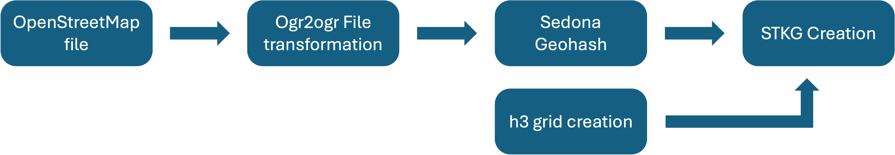

# Construction of Spatio-Temporal Knowledge Graph based on h3 grid cells
## Introduction
OpenStreetMap provides a rich data set to operate with a geospatial database. OpenStreetMap consists of several geometries and adds for each individual object also additional metadata information. This repository provides a set of methods to construct based on a .osm.pbf file a Spatio-Temporal Knowledge Graph, which write it's structure in a Delta Table.

## Background to OpenStreetMap
The file that OpenStreetMap provides is the .osm.pbf file. It is an alternative to an XML file and provides a compressed representation of the OpenStreetMap features by a factor of 30% compared to a gzipped xml planet file. OpenStreetMap divides it geometry features into three different elements:
| OpenStreetMap features  | Vector Geometries   |
| ----------------------- | ------------------- |
| Node                    | Point               |
| Way                     | LineString, Polygon |
| Relation                | MultiLineString, MultiPolygon, MultiPoint, GeometryCollection |

Additionally to the geometry object OpenStreetMap uses map features to represent additional information associated to the individual OpenStreetMap object. those are organized in a key value pair. The key in general provides the main category, where for instance the value specifies the main category more precisely. The common tags are displayed under the following web page: https://wiki.openstreetmap.org/wiki/Map_features.
## Prerequisites
The coding within the repository has been created using Python 3.10.13, with the use of Spark 3.5.0 and Sedona 1.5.1 using the respective Python bindings. In general the script can run on a local laptop as also parts of the repository on computation clusters due to involvement of Apache Sedona and Apache Spark. It is generally recommended to use for the Planet file not the laptop as the memory footprint could be too huge.

To install all dependencies, the [environment.yml](environment.yml) file is provided to create a Conda environemnt on which the code is based on. Run the following command to install all Conda packages:

``conda env create -f environment.yml``

## Input parameters for repository scripts
For the overall configuration of the different scripts, we have defined different variables that are used accross the different scripts in this repository. The definition of the file can be found in the [constants.py](helper/constants.py) script.
| Variable names          | Description         |
| ----------------------- | ------------------- |
| helper_path_directory   | Path where the different helper scripts and files can be found                     |
| osm_data_path           | Folder path where the OpenStreetMap .osm.pbf files are stored |
| osm_parquet_path        | Folder path where the OpenStreetMap parquet files are stored |
| osm_start_date          | Start date of the Overpass API retrieval |
| osm_end_date            | End date of the Overpass API retrieval |
| osm_area                | Area used for Overpass API and potential clipping for the created h3 grid|
| osm_clipping            | Boolean value to perform area/ geometry clipping for OpenStreetMap geometries |
| ogr_temporary           | Folder to store temporary files which are produced by the transformation between .osm.pbf files and GeoParquet |
| cpu_cors                | Number of CPU cores used to parallelize the coding snippets |
| spark_master            | Spark master for local deployment with defined number of cores|
| spark_temp_directory    | Spark temporary directory where Shuffle Writes are performed and stored |
| spark_driver_memory     | Memory size for the Spark Driver that is used for an individual Spark session |
| spark_executor_memory   | Memory size for the Spark Executor that is used for an individual Spark session |
| kg_output_path          | Output path for the cconstructed Knowledge Graph |
| grid_clipping           | Boolean value to perform area/ geometry clipping for base Worldmap geometries |
| grid_level              | Level of h3 grid that is used for the grid construction. Details for the grid cell size associated to a grid level can be found [here](https://h3geo.org/docs/core-library/restable) |
| grid_compaction         | Usage of grid compaction algorithm implemented by the h3 API |
| grid_parquet_path       | Output path of the cosnstructed h3 grid  |
| geo_hash_level          | Geohash level which controls the resolution of the constructed geohashes |
| sedona_packages         | List of compatible Apache Sedona packages that are used together with Delta Table jar files |
| geometry_file_path      | Foder path where the unified OpenStreetMap parquet files are stored |
## Data Gathering
For the OSM data of the repository, we base our coding on the provided .osm.pbf files provided by [Geofabrik](https://www.geofabrik.de/data/download.html). As a basis for downloads used in our work we have provided [a file](https://zenodo.org/records/10798949) which outlines the individual .osm.pbf file links we have downloaded. In addition, in file [osm_api_retrieval.py](data_gathering/osm_api_retrieval.py) we have provided a script to retrieve OpenStreetMap data over the Overpass API and store the API response in GeoParquet files.
## Data Preparation pipeline
For the data preparation pipeline the source is an osm.pbf file that is converted into a Delta Table which represents a Spatio-Temporal Knowledge Graph. In the following picture the complete pipeline for the data preparation is outlined.

### Convert .osm.pbf file to GeoParquet
For OpenStreetMap we base our analysis on .osm.pbf files. Generally, we provide with the file [osm_parquet_transform.py](data_gathering/osm_parquet_transform.py) the possibility to transform .osm.pbf files to geoparquet. This allows us to directly interact with OpenStreetMap data while using with Spark a distributed computation engine to construct our Knowledge Graph. Overall, the transformation is based on the ogr2ogr method from the GDAL library which transforms an OpenStreetMap file into five seperate files, each representing a seperate layer constructed by GDAL. The configuration for the conversion can be defined in the file [osmconf.ini](helper/osmconf.ini) and also adopted based on the needs by a user. A change in the configuration file might imply that a change of the subsequent scripts is needed. In the current implementation each individual file is processed sequentially, which currently does not utilize the full extent of an underlying resource.
### Sedona geohash
The different part files created by the conversion script are unified by the Python script [geoparquet_sedona.py](data_preparation/geoparquet_sedona.py). In addtion to the unification of the different geoparquet files, we calculate the geohash for all individual geometries. This helps to store additional metadata for the respective GeoParquet files.
### Creation of h3 grid
For the creation of our Knowledge Graph, we align the OpenStreetMap geometries using the h3 DGG created by Uber. Each individual grid cell is respresented as a regular hexagon (with the exception of 12 grid cells per level which have a pentagon structure). To generate the grid cells we use a base of the world map, which can be found under the [following folder](helper/worlddata/) in different data formats (Shapefiles, GeoParquet or GeoJSON). Based on the world geometries, we fill up each individual geometry with the respective grid cells based on the input parameters used in this repository. Similar to the OpenStreetMap data we store our generated grid using GeoParquet together with geohashes.
### Knowledge Graph creation
As a computational engine we use Apache Sedona to scale the Knowledege Graph creation process. For the Knowledge Graph creation we divide our creation in different parts. The first part transforms the tag structure of OpenStreetMap into a triple structure. Based on the fact whether a tag is marked as a commonly used tag, we transform the tag into a subclass relation for the Knowledge Grap. For OpenStreetMap tags that are not commonly used we use the OpenStreetMap ID into a subject, the tag key into a predicate and the tag value into an object. For OpenStreetMap geometries and h3 grid cell geometries we expose those into the constructed Knowledge Graph and store them in the WKT format.

For the grid cell based relation we compare the grid cells to each other. We extract three different relations: Neighborhood relation (isAdjacentTo), child relation (isChildCellOf) and parent relation (isParentCellOf). This takes the hierarchical dependencies into account for the h3 grid. This provides an interconnectivity to the individual grid cells.

Furthermore, we extract the spatial predicates between individual h3 grid cells and OpenStreetMap entities. For that we base the extraction of spatial predicates on the DE-9IM methodology. We build up the spatial relationship from the h3 grid cell to the OpenStreetMap entity.
